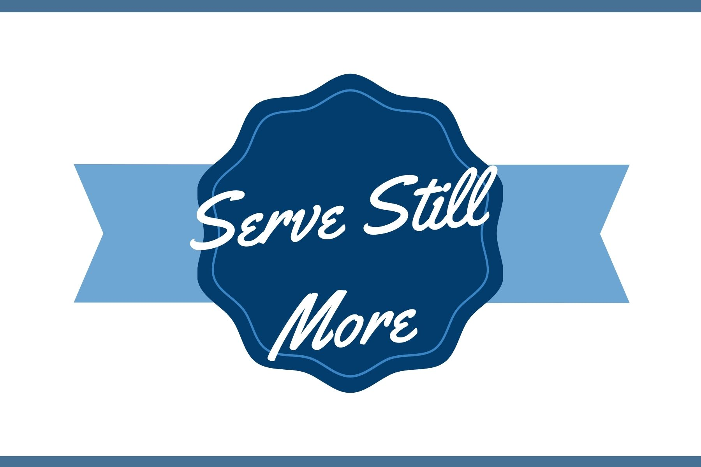

<h1 align="center">Serve-Still-More</h1>



<p align="center">**This project is inspired by the people of Lost River Church**</p>

<h2 align="center"><a  href=#>Live Demo</a></h2>

## Description
<p>In the Spring of 2020, the pandemic forced everyone to stay home. Church attendance was no exception. Having the ability to live stream a worship service was an excellent way to continue to give glory to God along with other members of the church. However, virtual church was no substitute for seeing familiar faces and keeping up with one another's lives the same as worshipping next to someone.</p>
<p>The Elders of Lost River Church set out to stay connected with all of the church members by calling everyone on a regular schedule. This ensured everyone's needs were heard and helped, specific prayers could be made, and everyone could maintain some sense of feeling like they were not alone.</p>
<p>The system for keeping up with how everyone was to be contacted involved a lot of manual data entry and a single excel spreadsheet. This app sets out to make the process automated, streamlined, and undoubtedly impove the process.</p>

## About the Project
### REACT
<h4>The entire application was built on React version 17.0.2</h4>
<p>When visiting the site, the user is immediately met with a login screen where they can log in or register as user.</p>
<p>Logging in is not true authentication as it only checks the data in the database to see if the user exists and stores that uses specific key in the session storage of the browser.</p>
<p>Depending on if the user specified thier role as an elder or a deacon upon registration, they will be presented with one of two dashboards.</p>
<p>The people in the church were equally put into groups to provide smaller groups of people to keep up with</p>
<p>The elder dashboard displays all of the groups and the role of each person in the group</p>
<p>The elder can click on any member in any group to view thier information, edit their information, or delete them from the database.</p>
<p>On the right hand side of the page, the elder can view messages in their assigned group that are to be shared to the deacons specifically (ie., tasks and events that need to be resolved or arranged) and also to the members (ie., information the deacons can share with the members when they call them). The elder can create a new news and notes for their group.</p>
<p>If a new member joins the church, they can be added to the member database and assigned to a group through the new member form. The form is accessed in the nav bar.</p>
<p>The deacon dashboard displays a list of members in your group. It also has a section that displays the members that:</p>
<ul>
<li>You, as a deacon, did not call previously</li>
<li>Have never been called</li>
<li>Have not been called since the beginning of the calendar week</li>
</ul>
<p>The deacon can click on any member in the list to view thier information, edit their information, or delete them from the database.</p>
<p>There is a text input box to record any conversations for the phone call that may be useful to pick up on the next time the member is called. The submission of the text marks the member as called and they disappear from the members to be called.</p>
<p>Below the text input there is a history section that displays all of the past records of phone conversations, when they occured, and who the conversation was with.</p>
<p>On the right hand side of the page, the deacon can view messages in their assigned group that was written to them specifically (ie., tasks and events that need to be resolved or arranged) and also to the members (ie., information to share with the members when they call them).</p>
<p>If a new member joins the church, they can be added to the member database and assigned to a group through the new member form. The form is accessed in the nav bar.</p>

### CSS
<p>Everything was styled using vanilla CSS styling by dedicated CSS files and in-line styling.</p>

### Other Resources

<a  href="https://dbdiagram.io/d/604ee756fcdcb6230b2421e4">Entity Relationship Diagram</a>

<a  href="https://www.figma.com/file/ju6MucGZdlFyUSQf3v9XTw/Serve-Still-More?node-id=0%3A1">Wireframe on Figma</a>

### Challenges
<p>When declaring a state variable and assigning its value as a subset of data from the database, I struggled with updating the DOM with the latest data. This was overcome by updating the data inside a function and placing the function call in a useEffect that ran whenever the data in the database changed. Ex: <a href="https://github.com/nch66862/serve-still-more/blob/main/src/Components/users/MemberCallList.js">Call List Component</a>, <a href="https://github.com/nch66862/serve-still-more/blob/main/src/Components/history/History.js">History Component</a></p>

## Project setup

<p>For the Database:</p>

```
git clone git@github.com:nch66862/serve-still-more-api.git
```
<p>Open the file in a code editor. Rename db.json.example to be db.json then save.</p>
<p>In the same directory, use this command in the terminal to start the JSON server:</p>

```
json-server -p 8088 -w db.json
```

<p>For the Site:</p>

```
git clone git@github.com:nch66862/serve-still-more.git
npm install
npm start
```


## Future scope

